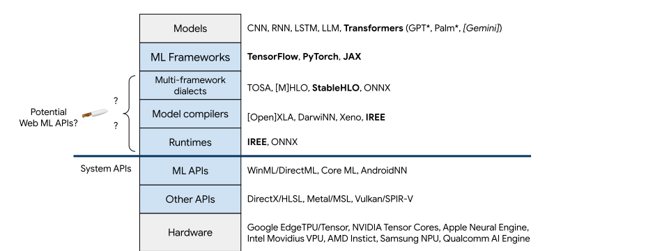
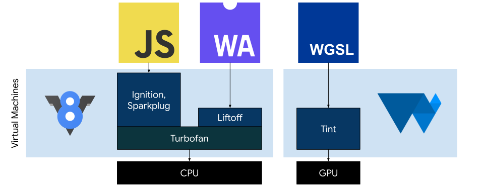
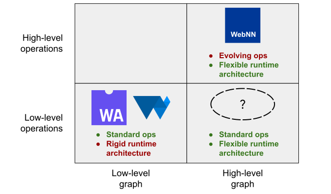

# WebTensor: Rationale

## From monoliths to modularity

Historically, ML evolved from a monolithic approach where models were coded and compiled directly into executables, to modular architectures where models are specified in various formats and move through tool chains that progressively optimize and specialize towards one or more machine architectures.

On this journey towards modularity, [TensorFlow](https://www.tensorflow.org/) first separated specific ML models from the general software that runs them. [XLA](https://www.tensorflow.org/xla) further separated the tool chain into a language and a compiler. [IREE](https://github.com/openxla/iree) is separating the compiler into various model-specific and architecture-specific passes, as well as a runtime. At the same time, a minor Cambrian explosion is taking place at each layer in this emerging stack with contributions from Microsoft, Intel, Facebook, Apple, NVIDIA, Samsung, Qualcomm, ARM, and others.

The challenge for developing a Web API for ML is to figure out where to cut this layer cake in a way that increases **portability** and **performance**, and enjoys the **longevity** to remain relevant and useful on the timescale of Web standards (years), even as the layers above and the layers below are all changing on the timescale of ML research (months).

## The Web's virtual machines

Given such a large and fast-moving ecosystem, it can be helpful to reason by analogy from earlier successful work defining stable APIs in the midst of evolving ecosystems, specifically V8 and Dawn. How this was done can guide our work in the newer ML ecosystem.

Today, a typical Web developer writes TypeScript and compiles it to JavaScript. Browsers then perform a _second_ compilation, of JavaScript code to machine code. JavaScript frees developers from worrying about whether their code will ultimately run on an ARM, x86 or RISC-V device, while V8 works out how to give that code the fastest possible performance on any given device. WebAssembly works similarly, starting at a slightly lower level.

For graphics, designers and developers build scenes with effects in WGSL. Browsers compile WGSL into shaders that run on physical GPUs. Like with JavaScript, WGSL frees developers from worrying about whether their graphics will be rendered by an NVIDIA, AMD, or Intel GPU, while Tint works out how to render those graphics as fast as possible on any given device.

The Web's trick for achieving its mix of portability, performance and longevity is to define in each case a standard **virtual machine** that developers can target, and let browsers ship compilers that map code for these virtual machines to the physical machine in the user's hand.

So what is the virtual machine for ML?

## Control flow programming vs. data flow programming

An easy approach to defining the virtual machine for ML would be to extend the existing virtual machines of the Web to cover ML as a use case. We have in fact done this: WebAssembly's SIMD extensions and WebGPU's upcoming ML extensions provide operations and data types amenable to running inference on modern ML models in the browser.

However there may be a limit to how well these virtual machines can run ML workloads. The Web's existing virtual machines are strongly influenced by the **control-flow** model of programming; think of programs performing diverse operations on relatively small amounts of data, like Microsoft Word. In contrast, ML workloads add a strong dependency on **data-flow**; think of programs performing relatively limited operations on vast data sets, like a MapReduce.

Given its unique properties, a data-flow oriented program expresses not merely the **operations** to perform on the data but the **graph** of dependencies between those operations, their inputs and their results.

Using WebAssembly and WebGPU for data-flow oriented workloads like ML requires converting the workload into a set of **low level operations** expressed in a **low level graph**. The low level operations (like `mov`, `add`, and control flow like loops) are at this point reasonably stable thanks to 60-years of evolution of CPU instruction sets and 30-years of evolution of their GPU equivalents. However the low level graph presents a problem.

The conversion to WebAssembly and WebGPU separates a data-flow workload into code that runs on the CPU and its memory, and code that runs on the GPU and its memory. Device-specific properties are not typically available when this conversion takes place, like whether the GPU shares memory with the CPU, and whether the GPU has a dedicated bus to the CPU. Some architectural elements, like the availability of ML-specific accelerator hardware, are entirely invisible in these APIs and are thus ignored. Adjusting a model after the fact to the architecture of a specific device requires unreliable workarounds, and some optimizations are by this time simply impossible.

As a result, while we should be proud of what WebAssembly and WebGPU have accomplished for the Web and for ML, looking to the future, the programming model for which they were designed does not on its own provide the highest-possible performance and efficiency for ML workloads on a broad range of user devices.

## WebNN

One proposal from Intel and Microsoft is [WebNN](https://www.w3.org/TR/webnn/), an API for expressing high-level operations in a high-level graph. This means the browser (and operating system) can reason about and optimize the computation graph and specialize it for the accelerators and memories on the device. However the high-level operations in the ML ecosystem are uniquely challenging for the Web for non-technical reasons.

In the short (by Web standards) life of the WebNN proposal, entirely new approaches to ML have come and gone. Most recently, the momentum behind LSTM models, seen as a way to build AI with "memory" of prior tokens and interactions, almost entirely gave way to transformers which, thanks to [attention](https://research.google/pubs/pub46201/), could handle such large prompts all at once that the entire memory problem could be punted to a simple transcript. This shift is only the latest in a long-running progression going back to RNNs, CNNs, FNNs, etc.

Each model type leans heavily on different ML operations, and APIs expressing high-level operations need to keep up. Indeed the proposed WebNN spec would require browsers to implement high-level operations like [`lstm()`](https://www.w3.org/TR/webnn/#api-mlgraphbuilder-lstm) and [`gru()`](https://www.w3.org/TR/webnn/#api-mlgraphbuilder-gru) that have already been surpassed in the ML ecosystem. In contrast, high-level support for transformers, the current state-of-the-art already deployed on servers and clients, remains [enqueued](https://github.com/webmachinelearning/webnn/issues/375) for a future revision of WebNN V2.

This additive approach also imposes long-term costs on implementers. As each new generation of ML models emerges, high-level APIs like WebNN merely expand to cover them while also making vague promises to support older models. Implementers of APIs like WebNN thus commit themselves to an unbounded set of functionality yet to be defined. The LLVM project puts it in slightly more technical language:

> _"HLOs [like WebNN] are expressive as a whole, but each op has very limited and fixed semantics: ops are not configurable. As a consequence, HLOs have evolved into a too large set of ops whose semantics intersect."_ -[Linalg Dialect Rationale - Lessons from XLA](https://mlir.llvm.org/docs/Rationale/RationaleLinalgDialect/#lessons-from-xlaa-namelessonsxlaa)

It is becoming clear that the velocity of the ML ecosystem's high-level model types and their associated operations is not compatible with the long-term and consensus-based approach that gives the Web its global reach and sustains a manageable support burden for browser implementers.

Fortunately, the Web's existing virtual machines and the WebNN proposal together point to a design space that might bridge this gap between the fast-moving ML ecosystem and the stable Web ecosystem.

Next: [Requirements for an ML Web API](requirements.md)
