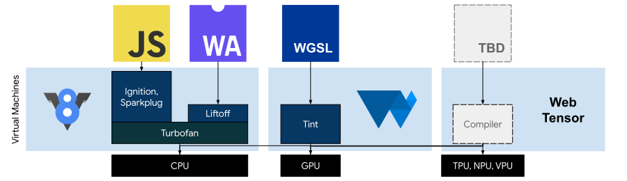

# Requirements for an ML Web API

To create an API that provides portability and high performance for data-flow workloads and that will remain relevant on Web timescales, we need to look at low-level operations expressed in a high-level graph. A low-level set of operations, like tensor math, is one the ecosystem can agree on and the browser community can implement and support over the long term. A high-level graph means implementations can observe the workload's data-flow patterns and optimize its execution to closely match the architecture and available hardware of the user's device.

To distinguish this approach from other proposals, I've given it the temporary name of WebTensor, a name chosen in part to convey the intent that the API will capture well-known, low-level and stable tensor math operations, rather than rapidly-evolving higher-level operations associated with "ML" or "NN" APIs. Unlike WebAssembly and WebGPU, WebTensor is explicitly graph-based.

The emerging requirements of the WebTensor API are:

* **High-level expression of a workload's computational graph**: retains whole-model information necessary to specialize a data-flow oriented program for diverse physical hardware architectures
* **Low-level expression of a workload's constituent operations**: provides stable and forward-compatible "tensor math" expressions of a model's operations as ML research continues; low-level expressions can be converted on-device to available accelerator instructions or lowered to CPU and GPU implementations in order to harness all available hardware capabilities and efficiencies

The requirements of a browser implementation of the WebTensor API are:

* **Scheduling**: data flow extraction and optimization
* **Execution**: tiling, fusion, buffer allocation
* **Codegen**: utilize any available hardware and specialized ISA
* **Runtime**: memory management, low-latency dispatch

There are a few projects that provide starting points for the design of such an API and any solution or implementation will likely borrow or derive from one or more of these:

* **Representations**: StableHLO, Linalg on Tensors
* **Compilers**: OpenXLA, IREE

The resulting compiler stack in Chrome would look like:

